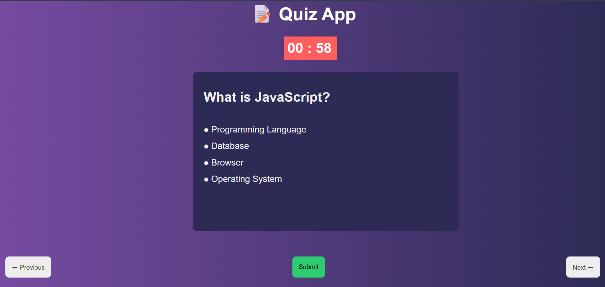
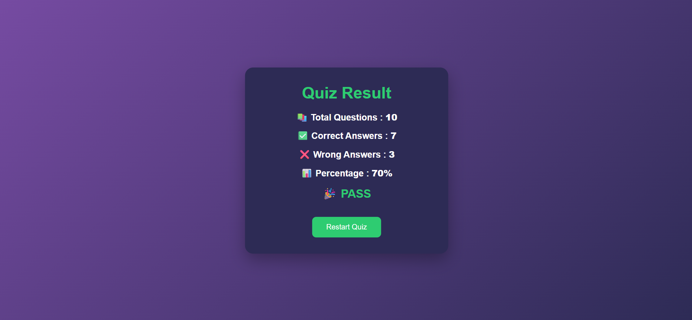

# Quzie-App🎯

Quiz Application built using **HTML**, **CSS**, and **JavaScript**. The app allows users to answer multiple-choice questions, navigate between questions, view their final score, and restart the quiz.

## 🛠️ Technologies Used

- 🌐 HTML

- 🎨 CSS

-  ⚡ JavaScript

## 🚀 Features

✅ Multiple Choice Questions

⏱️ Countdown Timer

⬅️ Previous Button

➡️ Next Button

⏳ 1 Minute Timer for each question

🎉 Pass / ❌ Fail Status

📊 Percentage  Calculation

📤 Submit Quiz

🏆 Final Score Screen

🔄 Restart Quiz

## 📂 Project Structure

📁Quiz App

index.html

style.css

script.js

image

README.md
 

## 📱 Result Screen

- 📚 Total Questions

- ✅ Correct Answers

- ❌ Wrong Answers

- 📊 Percentage

- 🎉 PASS / ❌ FAIL Status

## 📸 Screenshot

## 💿 Project Video
https://drive.google.com/file/d/1vKjCTW_6h65oHI5dwspKPJT-7ebmC2Gu/view?usp=sharing

